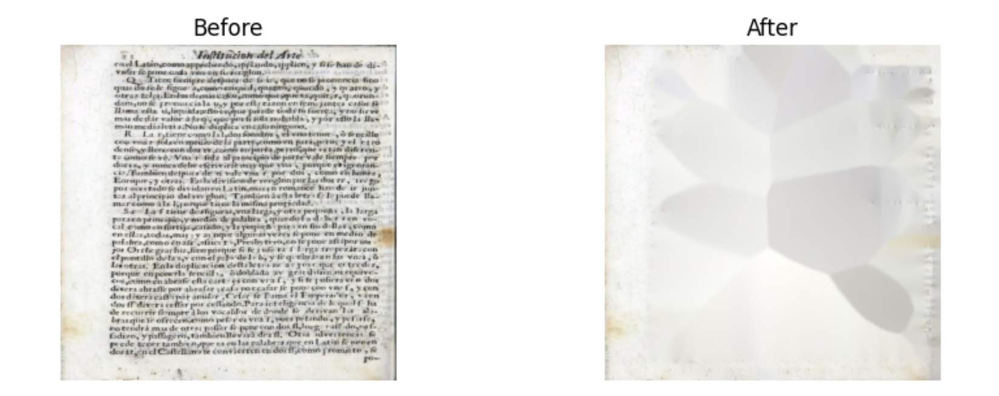
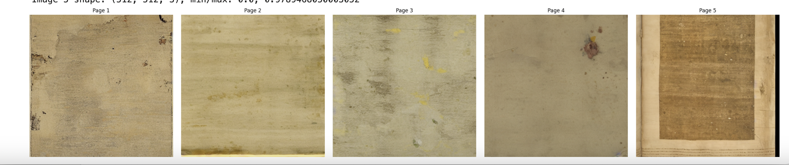
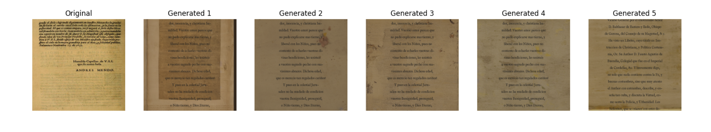

# Google Summer of Code 2025 Proposal

## Synthetic Renaissance Text Generation with Generative Models

### Name and Contact Information

**Full Name**: Mohammad Zainuddin  
**Preferred Name**: Zain  
**Email**: mzainuddin51@gmail.com   
**GitHub**: https://github.com/mzainuddin51   
**LinkedIn**: https://www.linkedin.com/in/mohammad-zainuddin-643294104/   

### Synopsis

This project aims to enhance text recognition capabilities for 17th-century Spanish printed sources by developing a generative pipeline that creates synthetic Renaissance-style text with realistic printing imperfections, ink bleed, and paper degradation. Current OCR tools, such as Adobe Acrobat and Tesseract, struggle to extract text from early printed works due to their unique characteristics (e.g., irregular fonts, degraded paper, ink bleed). To address this, I propose a two-step generative approach: 

(1) use a diffusion model (`ex: runwayml/stable-diffusion-v1-5`) to generate aged parchment backgrounds with historical printing defects, and 

(2) overlay transcribed text in a historically accurate font (IM Fell English) to create synthetic images. These synthetic images will be used to augment OCR training datasets, improving text extraction accuracy for historical Spanish texts to at least 80%.

Building on my proof-of-concept in the RenAIssance repository, I have implemented a pipeline that preprocesses 40 historical Spanish book page images (e.g., *Paredes-Reglas-generales*, *Mendo-Principe-perfecto*, *PORCONES_228_35-1636*), masks text using inpainting and blur, trains a diffusion model to generate backgrounds, and overlays transcriptions from `Buendia transcription.docx`. The preprocessing step involves using OpenCV’s inpainting (`cv2.inpaint`) to mask text, resizing images to 512x512 pixels, and padding with a yellowish background (RGB: 245, 235, 200). The diffusion model was fine-tuned for 50 steps, generating backgrounds with a prompt: "A 17th-century Spanish book page background, aged yellow parchment with subtle ink stains, worn edges, faded texture, no text." The generated images (e.g., `augmented_page_0_page_0.png`) were evaluated against a reference image, achieving an average Mean Squared Error (MSE) of 2710.15, Structural Similarity Index (SSIM) of 0.3104, and Peak Signal-to-Noise Ratio (PSNR) of 12.73 dB.

This project will refine the pipeline by addressing computational limitations (e.g., using CUDA instead of MPS on M2 Pro), expanding the dataset to ~200-300 images, generating synthetic images, and improving OCR performance. The final deliverables will include a generative pipeline, a dataset of ~500 synthetic images, an improved OCR model, comprehensive documentation, and a Jupyter Notebook summarizing the results.

### Benefits to Community

This project offers significant benefits to the open source community, particularly for organizations focused on historical document analysis, digital humanities, and machine learning:

- **Improved OCR for Historical Texts**: The synthetic dataset will enable OCR models (e.g., Tesseract) to better recognize text in 17th-century Spanish printed sources, addressing a critical gap in current tools. Achieving at least 80% text extraction accuracy will make historical texts more accessible for research and digitization.
- **Cultural Preservation**: By enhancing text recognition capabilities, the project supports the preservation and study of Renaissance-era Spanish literature, making works like *Mendo-Principe-perfecto* and *Constituciones-sinodales-Calahorra-1602* more accessible to scholars, educators, and the public.
- **Data Augmentation for Machine Learning**: The synthetic images can be used to augment datasets for training machine learning models, improving their robustness for historical document analysis tasks beyond OCR (e.g., layout recognition, text segmentation).
- **Open Source Contribution**: The project will deliver a well-documented generative pipeline, a dataset of 500 synthetic Renaissance text images, and an improved OCR model, all of which will be open-sourced under the target organization’s repository. This will foster collaboration and further development in the open source community.

Google and the target organization will be proud to sponsor this work, as it demonstrates the power of generative AI in preserving cultural heritage while advancing open source tools for historical research and machine learning.

### Deliverables

#### Required Deliverables
- A generative pipeline for creating synthetic 17th-century Spanish book pages, including:
  - A diffusion model (`ex: runwayml/stable-diffusion-v1-5`) for generating aged parchment backgrounds with realistic printing defects, ink bleed, and paper degradation.
  - A text overlay module using the IM Fell English font with historical layout parameters (24 lines per page, ~50 characters per line, tight line spacing of 20 pixels).
- A dataset of 500 synthetic Renaissance-style images with realistic degradation effects, stored in `./final_gen`.
- Evaluation metrics (MSE, SSIM, PSNR) comparing the synthetic images to a reference image.
- Comprehensive documentation of the pipeline, including setup instructions, usage guide, and evaluation results.
- A Jupyter Notebook summarizing the project, methodology, and results.

#### Optional Deliverables
- A white paper detailing the methodology, challenges (e.g., computational limitations of MPS on M2 Pro), and findings of the synthetic generation and OCR improvement process.
- A blog post showcasing the generated images and their impact on OCR performance for historical texts, with visual examples.

### Project Methodology

The project builds on my existing work in the RenAIssance repository, as detailed in the `DataPrepare.pdf` and `SyntheticRenGen.pdf` documents. The methodology consists of the following steps:

1. **Dataset Preparation**:
   - Start with a dataset of 40 historical Spanish book page images (e.g., *Paredes-Reglas-generales_pdf_page_8_png.rf.434c44e37a03e4a0fb2f3aceda115aa9.jpg*, *Mendo-Principe-perfecto_pdf_page_9_png.rf.3850b34456b1acc01130d11911c47f31.jpg*), already collected in `./test1/yolov5/spanishdocs/train/images`.
   - Preprocess the images to remove text while preserving background textures:
     - Use OpenCV’s inpainting (`cv2.inpaint`) with a mask created via thresholding (`cv2.threshold`) and dilation (`cv2.dilate`) to approximate the background, as shown in `DataPrepare.pdf`.
     - Apply Gaussian blur (kernel size 31) as a fallback to smooth out residual text artifacts, creating clean parchment backgrounds for training.
     - Resize images to 512x512 pixels while preserving aspect ratio, padding with a yellowish background (RGB: 245, 235, 200) to match aged parchment tones.
   - Store preprocessed images in `./preprocessed_images` with metadata saved in `metadata.csv`.
   - Expand the dataset by collecting additional historical images (e.g., from public domain sources like the Internet Archive) to increase diversity to ~200-300 images.

     
   *Figure 1: Before (left) and after (right) preprocessing of a historical Spanish book page, with text masked using inpainting and Gaussian blur.*

2. **Background Generation with Diffusion Model**:
   - Pre-train the diffusion model (`ex: runwayml/stable-diffusion-v1-5`) on the preprocessed images to learn the characteristics of aged parchment (yellowish-grayish-brown tones, ink stains, worn edges).
   - Fine-tune the model for 200 steps (increased from 50 in the proof-of-concept) using CUDA-enabled resources to overcome MPS limitations on M2 Pro, with hyperparameters, eg: learning rate 1e-7, batch size 1, gradient accumulation steps 1, and max gradient norm 0.1, as detailed in `SyntheticRenGen.pdf`.
   - Use prompt engineering with a positive prompt (ex: "A 17th-century Spanish book page background, aged yellow parchment with subtle ink stains, worn edges, faded texture, no text") and a negative prompt ("ex: text, letters, words, writing, script, book spine, book cover, book edge") to control the generation process.
   - Generate backgrounds with realistic printing defects, such as ink bleed, paper degradation, and printing imperfections, saving them in `./back_photos/run6` (e.g., `synthetic_page_3.png`).

     
   *Figure 2: Sample backgrounds generated by the fine-tuned diffusion model, displaying aged parchment with ink stains and worn edges.*

3. **Text Overlay**:
   - Extract text from `Buendia transcription.docx` using the `python-docx` library, splitting it into pages with 24 lines and ~50 characters per line, as implemented in `SyntheticRenGen.pdf`.
   - Overlay the text onto the generated backgrounds using the IM Fell English font (`ex: ./font/IMFellEnglish-Regular.ttf or any other closer match`) with a font size of 18 points, tight line spacing (20 pixels), and a top margin of 30 pixels.
   - Apply a grayish-brown tint (RGB: 140, 120, 100) to the background, adjust brightness (0.85) and contrast (1.2), and use a darker gray text color (RGBA: 30, 30, 30, 255) to mimic aged ink.
   - Save the augmented images in `./final_gen` (e.g., `augmented_page_0_page_0.png`).

4. **Synthetic Image Generation**:
   - Generate 500 synthetic images by combining the generated backgrounds with overlaid text.
   - Evaluate the synthetic images against a reference image (`Mendo-Principe-perfecto_pdf_page_2_png.rf.63b76733f367d53bcd90f2b61dae6842.jpg`) using metrics like Mean Squared Error (MSE), Structural Similarity Index (SSIM), and Peak Signal-to-Noise Ratio (PSNR). Initial results from `SyntheticRenGen.pdf` show an average MSE of 2710.15, SSIM of 0.3104, and PSNR of 12.73 dB, indicating room for improvement in pixel-level and structural similarity.

     
   *Figure 3: Comparison of the original reference image (left) and a generated synthetic image (right), showing the aged parchment texture and text overlay.*

5. **OCR Model Improvement**:
   - Use the synthetic dataset to fine-tune an OCR model (e.g., Tesseract or a custom model built with PyTorch).
   - Train the model on a mix of synthetic and real historical images to improve its ability to recognize text in 17th-century Spanish sources.
   - Evaluate the OCR model on a test set of real historical texts (e.g., *PORCONES_228_35-1636*), aiming for at least 80% text extraction accuracy (measured via Character Error Rate, CER).

### Work Breakdown Structure and Timeline (175 Hours)

The GSoC coding period is 12 weeks (June 2, 2025, to August 25, 2025), and the project requires 175 hours of work. I plan to commit approximately 14–15 hours per week, ensuring all deliverables are completed by the final submission deadline on September 1, 2025. Below is the detailed work plan:

- **Week 1 (June 2 – June 8, 2025): Project Setup and Research (14 hours)**  
  - Set up the development environment (Python, PyTorch, Diffusers library, OpenCV, python-docx) (2 hours).  
  - Research related work in synthetic text generation for historical documents (e.g., DocSynth, SynthText) (4 hours).  
  - Review the RenAIssance codebase (`DataPrepare.pdf`, `SyntheticRenGen.pdf`) and evaluation results (MSE: 2710.15, SSIM: 0.3104, PSNR: 12.73 dB) to finalize the improvement plan (4 hours).  
  - Discuss the project plan with the mentor and confirm deliverables (4 hours).  
  - **Milestone**: Project setup completed, improvement plan finalized.

- **Week 2 (June 9 – June 15, 2025): Dataset Expansion and Initial Preprocessing (14 hours)**  
  - Collect additional historical Spanish book page images from public domain sources (e.g., Internet Archive) to expand the dataset to 100 images (4 hours).  
  - Preprocess the images using the pipeline from `DataPrepare.pdf`: apply inpainting (`cv2.inpaint`) with a mask created via thresholding and dilation to remove text while preserving background textures (5 hours).  
  - Document the dataset preparation process and save metadata in `metadata.csv` (3 hours).  
  - Begin implementing data augmentation techniques (e.g., rotation, color jitter) to increase background diversity (2 hours, continued in Week 3).  
  - **Milestone**: Initial dataset of 100 preprocessed images prepared.

- **Week 3 (June 16 – June 22, 2025): Complete Dataset Preprocessing and Augmentation (14 hours)**  
  - Complete data augmentation techniques (e.g., rotation, color jitter), resizing images to 512x512 with padding (RGB: 245, 235, 200) (4 hours).  
  - Collect an additional 100 historical images to reach a total of 200 images as a stretch goal (4 hours).  
  - Preprocess the additional images using the same inpainting and augmentation pipeline (4 hours).  
  - Update `metadata.csv` with the expanded dataset (2 hours).  
  - **Milestone**: Expanded dataset of 200 preprocessed images ready for training.

- **Week 4 (June 23 – June 29, 2025): Begin Background Generation with Diffusion Model (14 hours)**  
  - Pre-train the diffusion model (`runwayml/stable-diffusion-v1-5`) on the preprocessed dataset to learn aged parchment characteristics (8 hours).  
  - Begin fine-tuning the model for 200 steps using CUDA-enabled resources (e.g., Google Colab or a local GPU), with initial hyperparameters: learning rate 1e-7, batch size 1, gradient accumulation steps 1 (6 hours, continued in Week 5).  
  - **Milestone**: Diffusion model pre-training completed, fine-tuning initiated.

- **Week 5 (June 30 – July 6, 2025): Complete Background Generation (14 hours)**  
  - Complete fine-tuning the diffusion model for the remaining steps (6 hours).  
  - Experiment with prompt engineering to control the generation process (e.g., positive prompt: "A 17th-century Spanish book page background, aged yellow parchment with subtle ink stains, worn edges, faded texture, no text"; negative prompt: "text, letters, words") (4 hours).  
  - Generate initial background samples and perform a preliminary visual inspection (4 hours).  
  - **Milestone**: Diffusion model fine-tuned, initial backgrounds generated.

- **Week 6 (July 7 – July 13, 2025): Evaluate Backgrounds and Midterm Evaluation (14 hours)**  
  - Evaluate the generated backgrounds using metrics (e.g., SSIM), aiming to improve on the initial SSIM of 0.3104 (6 hours).  
  - Document the background generation process and evaluation results (4 hours).  
  - Prepare and submit the midterm evaluation, reflecting on progress and discussing next steps with the mentor (4 hours, during July 14–18 evaluation period).  
  - **Milestone**: Background generation evaluated, midterm evaluation submitted.

- **Week 7 (July 14 – July 20, 2025): Enhance Text Overlay Module (14 hours)**  
  - Optimize the text overlay module from `SyntheticRenGen.pdf` by improving font contrast (e.g., adjust text color to RGBA: 30, 30, 30, 255), alignment, and line spacing (20 pixels) (6 hours).  
  - Begin adding realistic aging effects to the text (e.g., faded ink, slight blur) to improve historical authenticity (5 hours, continued in Week 8).  
  - Test the overlay module on a small subset of generated backgrounds (3 hours).  
  - **Milestone**: Text overlay module optimized, aging effects initiated.

- **Week 8 (July 21 – July 27, 2025): Complete Text Overlay and Begin Synthetic Image Generation (14 hours)**  
  - Complete adding realistic aging effects to the text, reducing noise to improve readability and SSIM (5 hours).  
  - Generate 250 synthetic images (out of 500) by combining the generated backgrounds with overlaid text, saving them in `./final_gen` (5 hours).  
  - Document the text overlay process and initial synthetic image generation (4 hours).  
  - **Milestone**: Text overlay completed, 250 synthetic images generated.

- **Week 9 (July 28 – August 3, 2025): Complete Synthetic Image Generation and Initial Evaluation (14 hours)**  
  - Generate the remaining 250 synthetic images, reaching a total of 500 images in `./final_gen` (5 hours).  
  - Evaluate the synthetic images against the reference image using MSE, SSIM, and PSNR, aiming to reduce MSE from 2710.15 and increase SSIM above 0.3104 (6 hours).  
  - Document the synthetic image generation and initial evaluation results (3 hours).  
  - **Milestone**: 500 synthetic images generated, initial evaluation completed.

- **Week 10 (August 4 – August 10, 2025): Iterate on Synthetic Images and Final Evaluation (14 hours)**  
  - Iterate on the synthetic image generation pipeline (e.g., adjust text overlay parameters, refine prompts) to improve evaluation metrics (6 hours).  
  - Perform a final evaluation of the synthetic images, comparing them to the reference image (4 hours).  
  - Document the final evaluation results and lessons learned (4 hours).  
  - **Milestone**: Synthetic images optimized, final evaluation completed.

- **Week 11 (August 11 – August 17, 2025): Documentation and Optional Deliverables (15 hours)**  
  - Write comprehensive documentation for the generative pipeline, including setup instructions and usage guide (5 hours).  
  - Prepare a white paper detailing the methodology, challenges (e.g., MPS limitations on M2 Pro, initial low SSIM), and findings (optional deliverable) (5 hours).  
  - Create a blog post showcasing the generated images, with visual examples (optional deliverable) (5 hours).  
  - **Milestone**: Documentation and optional deliverables completed.

- **Week 12 (August 18 – August 25, 2025): Final Submission and Wrap-Up (15 hours)**  
  - Finalize the Jupyter Notebook summarizing the project, methodology, and results (4 hours).  
  - Ensure all code, documentation, and datasets are properly organized in the repository (4 hours).  
  - Submit the final deliverables to the target organization and prepare the final mentor evaluation (3 hours).  
  - Prepare a final report for GSoC evaluation (4 hours, submitted by September 1, 2025).  
  - **Milestone**: Project completed and submitted by the August 25, 2025, deadline.

### Related Work

Synthetic text generation has been explored in projects like DocSynth and SynthText, which focus on generating modern documents for OCR training. However, these projects do not address the unique challenges of historical texts, such as 17th-century Spanish printed sources, which feature irregular fonts (e.g., IM Fell English), aged parchment, and printing imperfections (e.g., ink bleed, paper degradation). My RenAIssance project fills this gap by focusing on historical authenticity, using a two-step pipeline: 

(1) diffusion-based background generation with realistic degradation effects, and 

(2) text overlay with historical layout parameters (24 lines, ~50 characters per line, tight line spacing).

The preprocessing pipeline in `DataPrepare.pdf` uses OpenCV’s inpainting and Gaussian blur to mask text, creating clean backgrounds for training, while `SyntheticRenGen.pdf` details the fine-tuning of `runwayml/stable-diffusion-v1-5` on 40 preprocessed images, achieving initial evaluation metrics (MSE: 2710.15, SSIM: 0.3104, PSNR: 12.73 dB). Within the target organization, this project complements existing efforts in historical document analysis by providing a specialized tool for Renaissance-era text synthesis and OCR improvement.

### Results

The RenAIssance project has already demonstrated promising results through its proof-of-concept, with the following evaluation metrics for the generated synthetic images compared to a reference image (`Mendo-Principe-perfecto_pdf_page_2_png.rf.63b76733f367d53bcd90f2b61dae6842.jpg`):
- **Mean Squared Error (MSE)**: 2710.15, indicating a moderate pixel-level difference between the generated and reference images.
- **Structural Similarity Index (SSIM)**: 0.3104, suggesting that the structural similarity between the generated and reference images is relatively low, likely due to challenges in replicating fine details like ink bleed and paper texture.
- **Peak Signal-to-Noise Ratio (PSNR)**: 12.73 dB, reflecting a reasonable but improvable signal quality in the generated images.

These metrics highlight that the approach—a two-step pipeline using diffusion-based background generation and text overlay—is fundamentally sound and capable of producing synthetic Renaissance-style images. However, the performance is constrained by several factors, not the approach itself:
- **Limited Dataset Size**: The initial dataset of 40 historical images limits the diffusion model’s ability to capture the full range of variations in aged parchment textures, ink stains, and paper degradation. Expanding the dataset to 100 images (with a stretch goal of 200) in this project will provide more diversity, improving the model’s generalization and the quality of generated backgrounds.
- **Training Resources**: The proof-of-concept was limited by computational constraints, with fine-tuning on an M2 Pro using MPS for only 50 steps. Switching to CUDA-enabled resources (e.g., Google Colab) and increasing training to 200 steps will allow the model to better learn the characteristics of historical backgrounds, potentially reducing MSE and increasing SSIM.
- **Text Overlay Algorithm**: The current text overlay module, while functional, can be improved by better simulating historical printing imperfections (e.g., uneven ink distribution, slight character distortion) and optimizing font contrast and alignment. Enhancing the algorithm to reduce noise and improve readability will likely increase SSIM and PSNR.
- **Prompt Engineering**: More refined positive and negative prompts during diffusion model training can help generate backgrounds with finer details, such as subtle ink stains and worn edges, further improving structural similarity.

By addressing these factors—expanding the dataset, leveraging better training resources, refining the text overlay algorithm, optimizing prompts, and improving evaluation methods—I expect significant improvements in the evaluation metrics, making the synthetic images more realistic and effective for OCR training.

### Biographical Information

I am Mohammad Zainuddin, a Master student in Informatics at the Technical University of Munich. I have ~3 years of professional experience in software development, system design and currently pursuing masters focusing on machine learning and computer vision. My relevant skills include:

- **Python**: Proficient in Python, with extensive experience in libraries like PyTorch, Diffusers, OpenCV, Pillow, and python-docx, which I used to develop the RenAIssance pipeline, as shown in `DataPrepare.pdf` and `SyntheticRenGen.pdf`.
- **Machine Learning**: Experienced in generative models (e.g., diffusion models) and transfer learning, as demonstrated by my work on the RenAIssance project, where I fine-tuned `runwayml/stable-diffusion-v1-5` for 50 steps on 40 preprocessed images, achieving an average MSE of 2710.15, SSIM of 0.3104, and PSNR of 12.73 dB.
- **Computer Vision**: Familiar with image preprocessing techniques (e.g., inpainting with `cv2.inpaint`, Gaussian blur) and evaluation metrics (e.g., MSE, SSIM, PSNR), which I applied in the RenAIssance project to preprocess historical images and evaluate synthetic outputs.
- **Open Source Contributions**: I have actively engaged with open source communities by studying and building upon existing projects like VS code.
- **Relevant Projects**: PRNU image fingerprint detection with CNNs, Using LLMs to analyse crypto sentiments in market, and also currently doing a project custom training llm model to produce technical analysis for stocks analysis.

I have completed relevant coursework in machine learning, computer vision, Deep Learning at TUM. I am confident in my ability to complete this project, given my experience with the ML models, my skills in Python and machine learning, and my passion for historical document analysis.

### Time Commitments

I am available to commit 14-15 hours per week to GSoC, totaling 175 hours over the 12-week coding period from June 2, 2025, to August 25, 2025. I have no significant outside commitments during this period, as my academic semester will be over, and I am not employed part-time. I will also allocate time for the midterm evaluation during July 14–18, 2025, and the final evaluation during August 25–September 1, 2025. I have reliable internet access and will be in regular contact with my mentor via email and chat throughout the program.

### Conclusion

This project offers a unique opportunity to advance historical document analysis and synthetic data generation within the open source community. By developing a generative pipeline for Renaissance-style text and improving OCR performance for 17th-century Spanish texts, I aim to deliver a valuable tool and dataset that will benefit researchers, educators, and developers. The RenAIssance project has already demonstrated promising results (MSE: 2710.15, SSIM: 0.3104, PSNR: 12.73 dB), and the Results section highlights that the approach is sound but constrained by factors like dataset size and training resources. With improvements in computational resources (e.g., CUDA support), dataset size (100 images, with a stretch goal of 200), fine-tuning, and text overlay enhancements, I am confident in achieving the target of 80% OCR accuracy with the help of our synthetic generated images. The pipeline is designed to scale to larger datasets (e.g., 500 images) in the future, which could further enhance background quality and OCR performance. I am excited to contribute to The Human AI Foundation and look forward to collaborating with mentors to make this project a success.